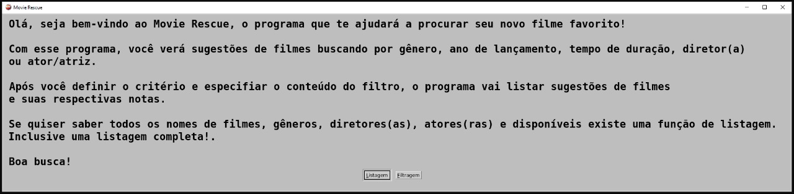
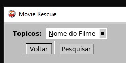
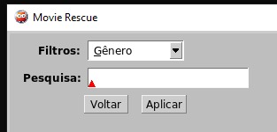
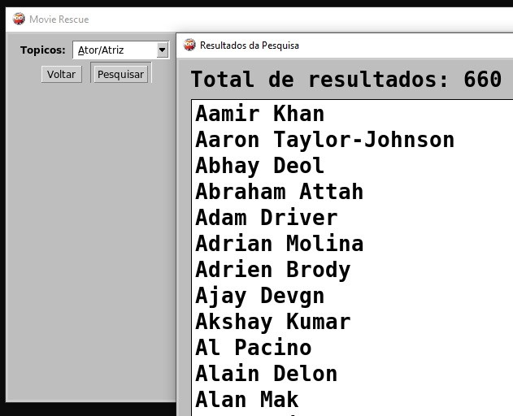
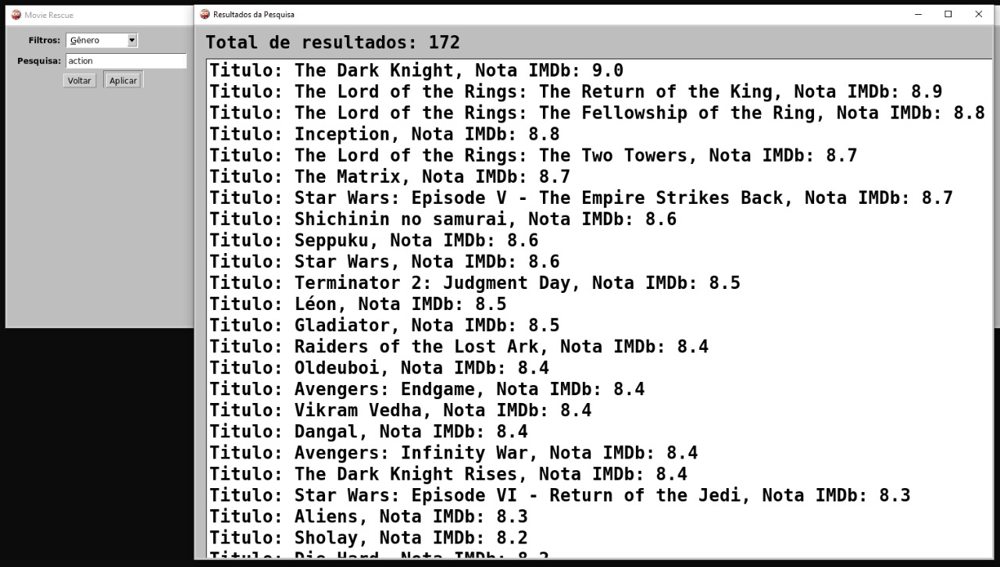

Paradigmas:
 - Logico

# Movie Rescue

**Disciplina**: FGA0210 - PARADIGMAS DE PROGRAMAÇÃO - T01 <br>
**Nro do Grupo**: 03<br>
**Paradigma**: Lógico<br>

## Alunos
|Matrícula | Aluno |
| -- | -- |
| 211031664  |  Catlen Cleane Ferreira de Oliveira |
| 202023681  |  Gabriel da Silva Rosa |
| 212008197  |  João Pedro Alves Machado |
| 190032821  |  Lorenzo Santos |
| 211043718  |  Paulo Victor Fonseca Sousa |
| 190020521  |  Valderson Pontes da Silva Junior |
| 190038900  |  Victor de Souza Cabral |


## Sobre 
O projeto de filtro de filmes é um sistema de recomendação desenvolvido em Prolog, uma linguagem de programação lógica. Ele permite aos usuários filtrar e listar filmes com base em diversos critérios, como gênero, ano, duração, diretor e ator. A estrutura do projeto é modular, facilitando a manutenção e a expansão futura do sistema. O projeto possui interface gráfica, e pode ser rodado no terminal também.

O projeto é dividido em três partes principais:

base de dados: Contém a base de dados dos filmes, onde cada filme é descrito por atributos como título, gênero, ano de lançamento, duração, diretor, ator principal e nota do imdb ([link para a base de dados](https://www.kaggle.com/datasets/harshitshankhdhar/imdb-dataset-of-top-1000-movies-and-tv-shows))

sistema de filtro Define as regras de filtro para diferentes critérios, além de uma regra para listar filmes com base no critério selecionado.

interface grafica : Fornece uma interface grafica  de usuário interativa para selecionar critérios de filtragem e visualizar os resultados

## Screenshots








## Instalação 
**Linguagens**: Prolog<br>
**Tecnologias**: SWI-prolog<br>

#### Passos para Instalação do SWI-Prolog

1. **Atualize a lista de pacotes do seu sistema:**

    ```sh
    sudo apt update
    ```

2. **Instale o SWI-Prolog:**

    ```sh
    sudo apt install swi-prolog
    ```

3. **Verifique se a instalação foi bem-sucedida:**

    Após a instalação, você pode verificar se o SWI-Prolog foi instalado corretamente executando o comando abaixo no terminal:

    ```sh
    swipl
    ```

    Se o SWI-Prolog foi instalado corretamente, você verá o prompt do Prolog, que deve se parecer com isso:

    ```plaintext
    Welcome to SWI-Prolog (threaded, 64 bits, version x.x.x)
    ...
    ?-
    ```

    Para sair do SWI-Prolog, digite `halt.` e pressione Enter.


## Uso 
Primeiramente o usuário deverá ter o prolog instalado no seu sistema, que pode ser instalado [nesse link](https://www.swi-prolog.org/download/stable).
Após isso ele deverá clonar o repositório e utilizar o comando [cd](https://guialinux.uniriotec.br/cd/) para entrar no repositório

```bash
git clone https://github.com/UnBParadigmas2024-1/2024.1_G3_Logico_MovieRescuer.git \
    && cd 2024.1_G3_Logico_MovieRescuer
```

Posteriormente, abra o terminal e digite `swipl`, em seguida pressione Enter. Quando o prompt do Prolog aparecer, execute o comando `consult('main.pl').` para carregar o programa principal. Após o carregamento, você poderá interagir com a aplicação de acordo com as funcionalidades implementadas.

### Interagindo Com a Aplicação
Após realizar o comando, a interface do projeto será aberta, possuindo a mensagem inicial do projeto, e duas opções, listagem e filtragem. no caso da listagem, é possível acessar todos os nomes dos filmes, generos, atores/atrizes, diretores, e ano de lançamento dos filmes que estão disponíveis na busca. Após acessar as opções, é possível filtrar filmes de acordo com os criterios que foram acessados na listagem através da opção "filtragem"

gif de Utilização do projeto:


## Vídeo
[Vídeo de apresentação do Projeto - Movie Rescue](https://github.com/UnBParadigmas2024-1/2024.1_G3_Logico_MovieRescue/blob/main/video/movie_rescue_video.mp4)

## Participações
Apresente, brevemente, como cada membro do grupo contribuiu para o projeto.
|Nome do Membro | Contribuição | Significância da Contribuição para o Projeto (Excelente/Boa/Regular/Ruim/Nula) |
| -- | -- | -- |
| Catlen Cleane Ferreira de Oliveira      | Excelente | Contribui com o filtro e na interação com o usuário no terminal |
| Gabriel da Silva Rosa                   | Excelente | Contribui com o filtro e na interação com o usuário no terminal |
| João Pedro Alves Machado                |Excelente  | Contribui com o filtro |
| Lorenzo Santos                          | Excelente |  Criei a base de dados original e contribui na interface gráfica|
| Paulo Victor Fonseca Sousa              | Excelente | Contribui para o filtro,interação com o usuário no terminal, e o readme, além de ter  criado a base de dados que foi utilizada  |
| Valderson Pontes da Silva Junior        | Excelente |  Contribui para o filtro e para o readme |
| Victor de Souza Cabral                  | Excelente |  Fiz a interface gráfica, interação com o usuário na interface e a listagem de opções que o usuário pode escolher |

## Outros

### Lições Aprendidas:

**Desenvolvimento da linguagem Prolog:** Aprendemos os principais conceitos em sala de aula e ao desenvolver o programa nos deparamos com várias questões práticas, o que nos deu a oportunidade de aprofundar mais no assunto. Prolog, sendo uma linguagem lógica, requer um modo de pensar diferente, focado em relações e regras lógicas.

**Modelagem de Dados:** Aprendemos a representar dados e suas relações, desenvolver regras para inferência lógica, e tratar exceções de forma declarativa.

### Percepções:

**Prolog é uma linguagem poderosa e única:** Facilita a resolução de problemas que envolvem lógica e inferência, como problemas de sistemas especialistas. No entanto, sua sintaxe e abordagem podem ser desafiadoras para aqueles acostumados com linguagens imperativas.

**Desenvolvimento iterativo:** Muitas vezes, descobrimos que problemas que pareciam difíceis de implementar eram mais simples do que imaginávamos, enquanto outras vezes subestimamos a complexidade de certos problemas lógicos.

### Contribuições e Fragilidades:

**Escolha do projeto:** Escolhemos desenvolver um sistema de sugestão de filmes por sua relevância prática e pelo desafio que apresentava em termos de manipulação de dados e lógica. Enfrentamos dificuldades durante a implementação dos filtros e na integração com a interface gráfica, mas conseguimos superá-las com alguns ajustes.

### Trabalhos Futuros:

**Otimização da performance:** Seria interessante continuar refinando o sistema para otimizar a performance das consultas, principalmente ao lidar com bases de dados maiores. Isso pode envolver a aplicação de técnicas avançadas de otimização e a utilização de bibliotecas especializadas.

**Expansão dos critérios de busca:** Seria interessante, futuramente, adicionar novos critérios de busca ao sistema, como avaliações de usuários e prêmios recebidos pelos filmes. Isso tornará o sistema de recomendação ainda mais robusto e útil.

## Fontes
[Playlist de Prolog - IFMG - Prof. Bruno Ferreira](https://www.youtube.com/watch?v=x_ahRnd1gTI&list=PLZ-Bk6jzsb-OScKa7vhpcQXoU2uxYGaFx)

[2023.2_G2_Logico_YouTubeRecommendation](https://github.com/UnBParadigmas2023-2/2023.2_G2_Logico_YouTubeRecommendation/tree/main)

[Base de dados Utilizada](https://www.kaggle.com/datasets/harshitshankhdhar/imdb-dataset-of-top-1000-movies-and-tv-shows)
